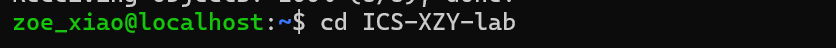
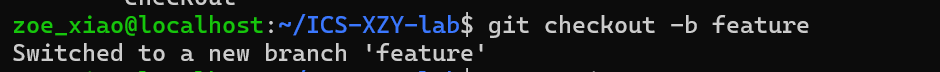
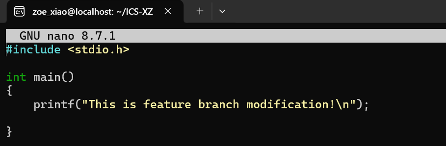
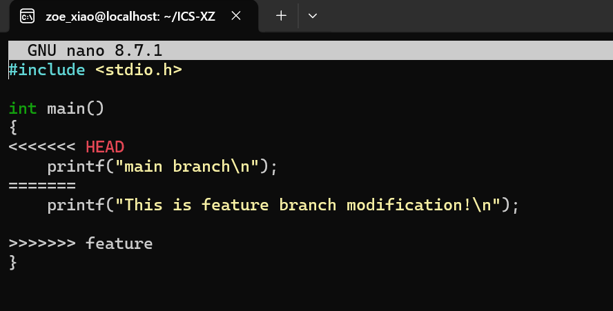
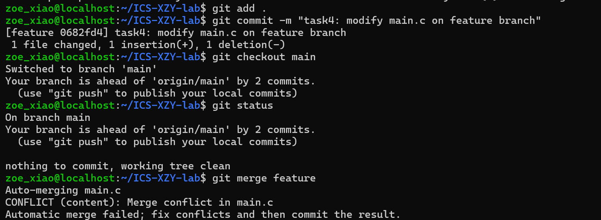
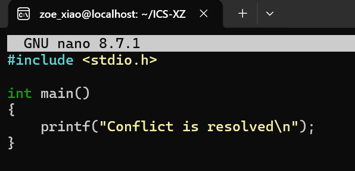
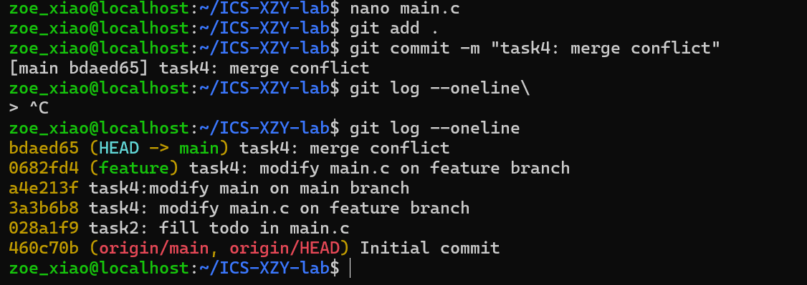

任务一：
1）我之前是没有多人系统开发的经历的，所以本次学习是我第一次接触git版本的控制工具，学习版本管理、分支、合并冲突等操作。
2）暂存。也就是git add，是把修改好的文件放入暂存区，并且可以选择修改进行提交。可以先筛选要保存的变更，不想要的更改可以暂时不加入暂存区。
   提交。也就是git commit，是把暂存区里的内容正式提交到自己本地的Git仓库，并且生成一条永久的版本记录，随时提交说明。
3） git branch在没有其他参数时用于列出本地分支，而git branch -a中的 -a 是 --all 的缩写，会同时列出本地分支和远程跟踪分支。

任务三：
1）Commit Message 规范：这篇文章主要介绍了Angular Commit message的编写规范，目的是让 Git 提交记录清晰可读并能自动生成Change log。规范中要求提交信息由Header、Body、Footer这三部分组成。Header是必需，格式为 <type>(<scope>): <subject>，其中 type 包括 feat（新功能）、fix（修补bug）、docs（文档）、style（格式）、refactor（重构）、test（测试）、chore（构建）七种；subject 需动词开头、第一人称现在时、首字母小写、结尾不加句号；Body 用于详细描述动机和对比，Footer 用于标注不兼容变动（BREAKING CHANGE）或关闭 Issue（Closes #xxx）；撤销提交则以 revert: 开头。文章还介绍了 Commitizen（交互式生成提交信息）、validate-commit-msg（校验格式）和 conventional-changelog（自动生成 Change log）三个配套工具，并指出非 JS 项目也可使用，但需引入 Node 环境。
2）语义化规范:这篇文章主要介绍了语义化版本 2.0.0（SemVer） 的使用规范，目的是解决软件依赖管理中的“依赖地狱”问题。其核心规则是版本号采用主版本号.次版本号.修订号（X.Y.Z）格式：做了不兼容的 API 修改时递增主版本号，做了向下兼容的功能性新增时递增次版本号，做了向下兼容的问题修正时递增修订号；先行版本号和编译信息可附加在后。使用前提是先定义好公共API，初始开发阶段可用 0.y.z 快速迭代，正式环境或有稳定 API 被依赖时发布 1.0.0；一旦发布不兼容改版必须递增主版本号且不能修改已发布版本，弃用功能需通过新的次版本号过渡，同时还提供了版本号校验的正则表达式和 BNF 语法定义，让版本号的变化能清晰传达修改性质，使依赖管理更可靠。

任务五：
实验步骤：
1）实验前的准备工作：首先打开模板仓库链接，并且使用这个模板创建我的个人仓库主页，并复制了仓库SSH地址；然后打开WSL终端，将仓库克隆到本地，显示在main分支。
2）修改main.c,完成TODO，并提交代码：nano main.进入，找到文件里要求编辑的代码位置，完成题目要求，并保存退出，git diff暂存文件，git commit提交本次修改。
3）分支管理：在main分支修改main.c某一行代码，保存退出；然后git checkout创建feature分支，并切换到feature分支，在feature分支中修改同一行代码，但是改成不一样的内容提交。
4）合并冲突：git checkout main切回main分支。git merge feature执行合并,触发冲突。
5）解决冲突：打开main.c，文件里出现了程序自动添加的冲突标记，并手动删除，只保留想要的代码，解决冲突后，提交合并结果。最后将上述所有提交结果推送到远程GitHub仓库中。